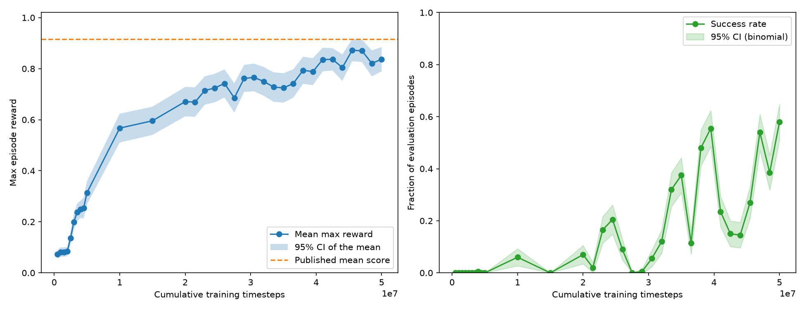

# MPC-RL

Reinforcement learning on the [Push-T](https://github.com/real-stanford/diffusion_policy)
Gymnasium environment, with the longer-term aim of learning a value function
good enough to serve as the terminal cost for an MPC planner.


Grey tee is the block, green outline is the goal pose, blue dot is the pusher.
This episode reaches 0.965 coverage in 53 steps.

## Results



PPO from scratch on state observations, 50M steps:

| | start | best |
|---|---|---|
| Mean max coverage reward | 0.07 | **0.87** |
| Success rate (coverage > 0.95) | 0% | **58%** |

For reference, the published Push-T scores of 0.915 / 0.969 come from
*imitation learning on human demonstrations*, not from-scratch RL.

Note the two panels diverge late in training. The evaluation reward is capped
at 1.0, so once the policy is good, converting a 0.93 episode into a success
barely moves the mean but is the whole point. **Success rate is the metric to
judge by**; mean max reward saturates.

## What it took to make PPO work

Every one of these was independently fatal - the success rate sat at exactly 0%
until all of them were fixed.

- **Normalize observations.** Raw state is in `[0, 512]`; SB3's default MLP
  expects roughly unit scale. Without `VecNormalize` the policy barely moved
  off its initialization.
- **Rescale the action space.** Push-T's action is an absolute pusher target in
  `Box(0, 512)`, but the policy's Gaussian head naturally emits values around
  `[-1, 1]`. Untouched, every state produced an action clustered in `[0, 2]` -
  the pusher crept toward the origin and stopped, and no amount of training
  fixed it. `RescaleAction` first, then **delta actions** (a bounded offset from
  the current pusher position), which decouples exploration breadth from
  placement precision - with absolute targets they are the same quantity.
- **Control the policy std explicitly.** `ent_coef=0.01` made std diverge;
  `ent_coef=0.0` let it collapse to 0.046, at which point the `1/std^2` policy
  gradient produced `approx_kl` spikes of 3-4 (vs. a normal 0.01) that
  destroyed the policy. Neither extreme is a tuning problem you can solve by
  bisection: use a small `ent_coef`, a `target_kl` cap, and a hard floor on
  `log_std` chosen from physical units (std 0.12 with delta actions is ~1.6px
  of jitter against a ~2-3px success tolerance).
- **Run parallel environments.** With one env, a policy update was estimated
  from ~7 episodes of a very heterogeneous task distribution - roughly 38%
  relative noise on every gradient. 16 envs cut that ~4x and made training ~5x
  faster in wall-clock.
- **Fix the evaluation before trusting any of it.** The eval seed originally
  included the timestep, so *every checkpoint scored a different task set* and
  the curve mixed policy change with task resampling. With a fixed task set,
  200 episodes and a reported SEM, differences under ~0.04 are visibly not
  distinguishable - a lot of earlier "is it improving?" reading was noise.

## Push-T gotchas

Push-T was built as an imitation-learning benchmark, and several of its
properties are traps when used as an RL objective. All are worked around in
`train_ppo.py`, on the training environment only, so evaluation stays
comparable to the published numbers.

**Succeeding was worse than not succeeding.** The environment pays a dense
per-step reward of `coverage / 0.95` and sets `terminated = is_success`, so
crossing the threshold forfeits the remaining reward stream. At `gamma=0.99`
over 300 steps, hovering at 94% coverage is worth 39-91 more discounted return
than finishing. The optimal policy is literally "approach the goal and never
finish", which is exactly what it did.

**The reward then saturates exactly at the threshold.** `clip(coverage/0.95, 0, 1)`
means improving coverage beyond 0.95 earns nothing, so the policy optimises to
land *on* the boundary and crossing is close to a coin flip. Measured at 20M
steps: 107 of 200 evaluation episodes sat in the 0.90-0.999 band while only 14
crossed, and success counts jumped 12 -> 0 -> 14 between checkpoints while the
mean rose smoothly.

**`reset_to_state` does not use the observation's frame.** Setting the body
angle rotates the tee about its centre of mass, displacing it, so the block
position you pass in is not the one reported back. Passing the goal pose
directly yields only 0.298 coverage; to land at *observed* `(256, 256)` at
angle `pi/4` you must pass `(224, 243)`. The offset is a fixed local vector
(~`[31.8, -13.2]`) rotated by the object angle. The observation and the goal
pose do agree with each other - only the `reset_to_state` input differs.

**Success needs precision-assembly tolerances.** Coverage > 0.95 requires the
block within ~2-3px and ~1-2 degrees:

```text
 2 px off -> 0.951      2.9 deg off -> 0.942
 4 px off -> 0.899      5.7 deg off -> 0.888
10 px off -> 0.751     11.5 deg off -> 0.785
```

**The state observation is not Markov.** `[pusher_x, pusher_y, object_x,
object_y, object_angle]` has no velocities and no history, yet the pusher is a
PD-controlled body with momentum and contact outcomes depend on the block's
linear and angular velocity. Frame stacking is the obvious remedy and is not
yet implemented here.

## Setup

Python 3.12. The `gym-pusht` dependency chain is not compatible with 3.14, and
Push-T requires Pymunk 6.x APIs, so `pymunk<7` is intentional.

```powershell
py -3.12 -m venv .venv312
.\.venv312\Scripts\Activate.ps1
python -m pip install -r requirements.txt
```

## Usage

```powershell
# Train (resumable; --resume + --resume-vecnormalize continue a checkpoint)
python train_ppo.py --timesteps 5000000 --model ppo_pusht --n-envs 16

# Plot the curve across one or more (resumed) runs
python plot_training_curves.py ppo_pusht_parallel ppo_pusht_stdfloor

# Paired comparison of two checkpoints on the shared task set
python compare_checkpoints.py <baseline> <candidate>

# Record an episode as an animated GIF
python record_episode.py --model ppo_pusht_stdfloor

# Evaluate on the native reset distribution, and plot the critic
python evaluate_ppo_distribution.py --model ppo_pusht_stdfloor --episodes 100
python plot_ppo_value.py --model ppo_pusht_stdfloor
```

Training-only wrappers, each with CLI flags: `CoverageRewardWrapper`,
`SuccessHandlingWrapper`, `ExploringStartsWrapper` (curriculum resets near the
goal), `ShapedRewardWrapper`, `DeltaActionWrapper`. Models save a
`_vecnormalize.pkl` and `_envconfig.json` sidecar so evaluation scripts
reconstruct matching observation and action semantics automatically.

## Earlier work: value-function baselines

Before the PPO track, the repo explored Monte Carlo and fitted-Q value
estimates from random-policy rollouts: `value_function_baseline.py` (linear and
RBF kernel-ridge `Q(s,a)`), `fitted_q_iteration.py` / `online_fqi.py` (model-free
Bellman iteration, inspired by [`milutter/value_iteration`](https://github.com/milutter/value_iteration)),
`plot_goal_value.py` and `validate_value_function.py`. Those estimates were
diagnostic only - a random-policy dataset does not give a reliable estimate of
`V*`, and the value surface did not reliably peak at the goal. The PPO critic
does, which is why the project moved here.

## Next steps

1. Frame stacking, to make the observation Markov.
2. Anneal the policy-std floor, trading exploration for final placement
   precision once the approach behaviour is learned.
3. Use the PPO critic as the terminal cost in an MPC planner - the original
   goal of the project.
